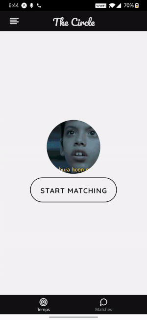

# The Circle
An Algorithm Centric Networking app.
Made from React-Native, Redux, Firebase Realtime Database.

Matching with another User  | Your profile and Editing options
-------------------------------------------------- | -----------------------------------------------------
  | 

## How it works
1. The app makes temporary chatrooms based on **The friends of your friends**. In Circle your friends are called actually called **Permis**. And the friends of your friends are called **Temps**. The registration works through OTP verification of phone number and a password.

2. Once inside a chatroom both the people can talk anonymously and then decide whether they want to -
    1. Skip to the next temp.
    2. Like the current temp.
    3. Skip the current temp and turn matching off.
    
3. If both the temps in a chatroom like each other at the same time, they are shifted to each other matches, where their identity is revealed. Their previous chat persists

4. Users can turn their matching on or off at any time, making them available, or unavailable for chatrooms. As the app can match you with a person even when you're offline!

